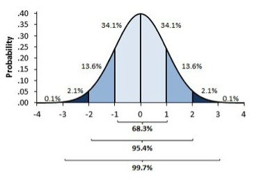
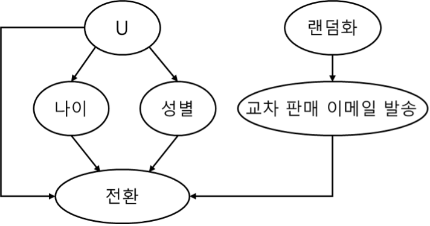

# Causal Inference Chapter 3-4

작성자 : [최재윤](https://www.linkedin.com/in/jaeyun-choi-0b64292a0/)

## Chapter 3 Stats Review

### 추정(Estimate)
가끔은 평균이나 비율과 같은 모집단의 모수(parameter)를 추정하는 것이 연구의 관심이 되는 경우가 있습니다. 모수를 추정하기 위해 무작위 추출(random sampling)을 사용해 표본 데이터를 만들고 이를 이용하여 모수의 값을 추측하는 절차를 진행되어야 합니다.
이 때 단일값의 형태로 모수를 추정하는 것을 점 추정(point estimate), 범위 형태로 표현되는 것을 구간 추정(interval estimate)이라고 합니다.

추정값의 표준오차(Standard Error)

반복적인 표본 추출을 통해 모집단의 모수에 대한 추정치가 항상 정확하게 일치하는 경우는 어려울 것입니다. 따라서 만약 추정치들 간의 변동을 계산할 수 있다면 불확실성을 정량적으로 파악할 수 있을 것입니다. 
해당 변동은 표본평균들의 분산으로 측정될 수 있습니다. 이 때 표본평균들의 표준편차를 평균에 대한 표준오차(standard error)라고 하고 다음과 같이 계산할 수 있습니다.

$SE = \frac{\sigma}{\sqrt n}$

### 신뢰구간(Confidence interval)
위에서 점추정치에 대한 불확실성의 정밀도를 평가하기 위해 표준오차를 계산한다고 언급했습니다. 그러나 표준오차는 대부분 구간추정치를 계산하는데 사용됩니다. 
구간추정의 대표적인 방법이 바로 신뢰구간입니다. 신뢰구간은 점추정치를 중심으로 양쪽으로 표준오차의 n배수 만큼의 범위를 나타낸 구간입니다.
신뢰구간을 계산하기 위해서는 중심극한정리(Central limit theorem)를 이용합니다. 중심극한정리는 표본의 크기가 충분히 클 때, 모집단의 분포와 상관없이 모평균을 추정하기 위해 사용되는 표본평균들의 분포는 정규분포를 따른다는 이론입니다. 
따라서 모평균에 대한 신뢰구간을 구하기 위해 정규분포의 특성을 이용하여 계산할 수 있습니다. 동일한 크기의 표본들을 반복적으로 뽑아서 표본평균들을 계산하게 된다면 이들 중 95%는 모평균을 중심으로 1.96배의 표준편차 내에 존재하게 될 것입니다. 
정리하면 모평균에 대한 95% 신뢰구간은 다음과 같이 구할 수 있습니다.

$\bar x \pm 1.96 \times \frac{\sigma}{\sqrt n}$

신뢰구간을 해석할 때 한 가지 주의해야할 점이 있습니다. 보통 사람들은 신뢰구간을 ‘해당 구간 내에 실제 모평균이 있을 확률은 95%이다.’라고 해석합니다. 그러나 모평균은 고정된 값이기 때문에 엄밀히 말하면 틀렸다고 할 수 있습니다. 
정확한 정의는 ‘동일한 크기의 표본을 반복해서 추출했을 때, 신뢰구간이 모평균을 포함할 확률이 95%이다.’라고 할 수 있습니다. 그러나 사람들이 자주하는 해석이 이해하기 쉽고, 불확실성의 정도를 표현했다는 점에서 큰 문제가 되지는 않습니다.

### 가설검정(Hypothesis test)
가설검정은 추정과 더불어 불확실성을 표현하는 대표적인 방법입니다. 가설검정의 일반적인 절차는 다음과 같습니다.

1. 연구에 대한 **귀무가설**과 **대립가설**을 설정합니다.
2. 귀무가설에 해당하는 **검정통계량**을 표본 데이터를 통해 계산합니다.
3. 계산한 검정통계량 값을 확률분포의 값과 비교합니다.
4. **P-value**를 통해 결과를 해석하고 결론을 내립니다.

귀무가설: 새로이 증명하고자 하는 가설과 반대되는 가설로 보통 모집단에서는 효과가 없다라는 내용의 가정을 많이 하게 됩니다.

대립가설: 귀무가설의 반대되는 내용의 가설로 우리의 연구를 통해 증명하려는 가설입니다.

검정통계량: 표본 데이터를 이용해 가설검정에 사용될 기준을 계산하게 됩니다. 이때 귀무가설이 맞지 않다는 증거를 데이터가 얼마나 보여주고 있는지 나타낼 수 있는 기준을 검정통계량이라고 합니다. 일반적으로 값이 크면 클수록 증거의 크기는 커지게 됩니다. 가장 일반적으로 사용하는 통계량은 t 통계량이고 다음과 같이 계산합니다.

$t_{\Delta} = \frac{\mu_{\Delta} - H_0}{SE_{\Delta}} = \frac{(\mu_1 - \mu_2) - H_0}{\sqrt{\frac{\sigma_1^2}{n_1} + \frac{\sigma_2^2}{n_2}}}$

위의 공식대로 계산한 값을 확률분포 값과 비교하여 가설 기각 여부를 정하게 됩니다.

p-value: 모든 검정통계량은 그 형태가 알려져 있는 이론적인 확률분포에 따르게 됩니다. 이 확률분포의 면적 중 표본으로부터 얻어진 검정통계량 값에 해당하는 면적을 p-value라고 합니다. 
P-value는 귀무가설이 맞다고 가정한 경우에 주어진 표본 데이터가 현재와 같거나 더 극단적인 결과를 얻을 확률을 의미합니다. 

예를 들어 동전을 던져서 앞면이 나올 확률은 보통 50%입니다. 하지만 만약 동전을 열 번 던져서 열 번 모두 앞면이 나왔다면, 우리는 "이 동전은 평범한 동전이 아닐 수도 있어"라고 생각할 수 있습니다. 여기서 p-value는 이런 열 번 모두 앞면이 나오는 결과가 우연히 일어날 확률을 수치로 나타내 줍니다. 
p-value가 매우 낮으면, 결과가 우연이 아니라는 것을 의미하고, 높으면 우연일 가능성이 크다는 것을 의미합니다.
일반적으로 p-value가 유의수준 α보다 작다면 귀무가설을 기각할 수 있는 충분한 증거가 있다고 봅니다.

## Chapter 4. Graphical Causal Models

### 인과관계의 시각화
인과관계는 그래프로 표현할 수 있습니다. 이를 인과 그래프라고 하며 DAG (directed acyclic graph)라고도 합니다. 인과 그래프는 노드와 화살표로 구성되어 있습니다. 아래의 예시를 통해 자세히 살펴보시죠.

그래프의 각 노드는 확률변수입니다. 화살표를 사용하여 한 변수가 다른 변수의 원인이 되는지 표시하게 됩니다. 그리고 여기서 U는 관측되지 않은 변수를 의미합니다. 따라서 위 예제에서는 전환의 원인은 교차 판매 이메일 발송, 나이, 성별, U임을 나타냅니다.

### 인과 그래프 구조 유형
1. 사슬 구조

사슬 구조는 가장 간단한 구조로 T는 M의 원인이 되고 M은 Y의 원인이 됩니다. 이때 중간 노드 M은 T와 Y 사이의 관계를 매개하는 역할로 매개자(mediator)라고 합니다. 이 그래프에서 인과관계는 한 방향으로만 흐르지만, 연관관계는 양방향으로 흐릅니다. 따라서 T와 M, 그리고 Y는 서로 pairwise하게 봤을 때는 독립이 아닙니다.
이 때 매개자 M을 고정한다면, T와 Y 사이의 종속성이 차단되어 T와 Y는 독립이게 됩니다.

2. 분기 구조

분기 구조에는 공통 원인이 있습니다. 하나의 변수가 다른 여러 변수의 원인이 됩니다. 분기 구조에서 연관관계은 화살표의 반대 방향으로 흐릅니다. 분기 끝에 있는 변수들은 서로 연관이 있지는 않지만 동일한 원인을 공유하기 때문에 같이 움직이게 됩니다. 인과추론에서 이 공통된 원인을 교란 요인(confounder)이라고 부릅니다.
분기 구조에서는 공통 원인을 공유하는 두 변수는 종속이지만 공통 원인이 고정된다면 독립입니다.

3. 충돌부 구조

충돌부 구조는 두 노드가 하나의 자식을 공유하지만 두 부모 노드는 서로 독립인 경우입니다. 그러나 공통 효과인 자식 노드를 고정한다면 두 부모 노드는 서로 종속이 됩니다. 이는 한 가지 원인이 이미 효과를 설명했기 때문에 다른 원인의 효과를 어느정도 예측할 수 있어지기 때문입니다. 이는 종종 다른 요인에 의해 설명되는(explaining away) 현상이라고 합니다.

### 식별 재해석
인과 그래프를 배웠다면 편향을 없애기 위해서 무엇을 해야 하는지 이해할 수 있게 됩니다. 식별은 그래프 모델에서 독립성과 밀접한 관련이 있습니다. 인과 그래프에서 처치, 결과 간의 인과관계를 분리하는 과정을 식별이라고 할 수 있습니다.
하나의 예시를 들어보겠습니다. 한 기업에서 컨설팅을 받는 것이 향후 6개월 수익에 도움이 되는지 확인하고 싶어 합니다. 이 때 좋은 컨설팅을 받기 위해서는 이전 6개월 수익이 좋아야 하고, 이는 역시 이후 6개월 수익에도 영향을 주게 됩니다. 따라서 다음과 같은 인과 그래프를 그릴 수 있습니다.

그래프에서 확인할 수 있듯이 직접적인 인과 경로와 공통 원인으로 교란받는 비인과 경로가 존재합니다. 여기서 이전 6개월 수익이라는 비인과 경로를 뒷문 경로(backdoor path)라고 합니다. 따라서 컨설팅과 이후 6개월 수익의 인과관계를 파악하기 위해서는 이전 6개월 수익을 조건부로 설정하여 하나의 인과 경로만을 남겨야 합니다.

### 교란편향
교란편향(confounding bias)는 일반적으로 처치와 결과가 공통 원인을 공유하기 때문에 생기는 편향으로 주로 뒷문 경로가 있을 때 발생합니다. 따라서 앞에서 설명한 것처럼 공통 원인을 조건부로 보정한다면 교란편향을 보정할 수 있습니다.
하지만 모든 공통 원인을 보정하기는 현실적으로 어렵습니다. 따라서 다음과 같은 방법으로 교란편향을 해결하고자 합니다.

1. 대리 교란 요인
때로 측정되지 않은 교란 요인으로 보정이 어려운 경우가 있습니다. 이 때 교란 요인에 대한 대리변수를 이용한다면 어느정도 편향을 줄일 수 있습니다. 이 때 사용하는 대리변수를 대리 교란 요인이라고 합니다.

2. 랜덤화
처치를 무작위로 배정하면 관측할 수 없는 교란 요인이 있는 그래프를 처치의 유일한 원인이 랜덤성인 그래프로 바꿀 수 있습니다.

### 선택편향
교란편향이 공통의 원인을 통제하지 않을 때 발생하는 것이라면, 선택편향은 보통 우리가 통제해야하는 변수보다 더 많은 변수를 통제할 때 발생합니다. 한 가지 간단한 예시를 들어보겠습니다. 

어떤 연구자가 “하늘을 쳐다보는 것이 주변의 다른 보행자들도 하늘을 쳐다보게 하는데 영향을 주는가?”라는 질문에 답하기 위해 무작위 실험을 진행했다고 해봅시다. 이 때 무작위 실험으로 인해 교란 편향은 없다고 가정하면 하늘을 쳐다보는 행동과 주변 사람들이 같이 하늘을 쳐다보는 것의 연관성이 인과적 효과를 반영할까요? 

여기에는 또다른 잠재적 문제가 있습니다. 해당 분석에는 자신의 데이터를 사용하는 것에 대해 동의한 사람들의 데이터만 포함되어 있습니다. 보통 부끄러움을 많이 타는 사람들은 하늘을 잘 쳐다보지 않는 경향이 있을 수 있고 연구에 참여하지 않았을 가능성이 큽니다.

다른 예시로 임상시험에서 정의하는 통계 분석군 중 PPS(Per Protocol Set)라는 것이 있습니다. PPS는 임상시험계획서에 따라 잘 순응하여 임상시험을 진행한 대상자만을 포함하는 것을 말합니다. 여기서도 임상시험을 모범적으로(?) 진행한 대상자만으로 분석을 실시하므로 선택편향이 생길 수 있습니다.
선택편향을 보정하기 위해서 교란편향과 유사하게 다른 관측가능한 변수를 활용하거나 연구 설계 단계에서 편향 발생 가능성을 최소화 시키도록 설계를 해야 합니다.

참고문헌 : 
1. [https://causalinferencelab.github.io/Causal-Inference-with-Python/landing-page.html](https://causalinferencelab.github.io/Causal-Inference-with-Python/landing-page.html)

2. [Hernán MA, Robins JM (2020). Causal Inference: What If. Boca Raton: Chapman & Hall/CRC.](https://www.hsph.harvard.edu/miguel-hernan/wp-content/uploads/sites/1268/2024/04/hernanrobins_WhatIf_26apr24.pdf)

3. [실무로 통하는 인과추론 with 파이썬](https://product.kyobobook.co.kr/detail/S000212577153)